+++
title = "Manifest-Driven Development: My AI Workflow After a Year of Getting It Wrong"
description = "How I stopped losing context, burning tokens, and re-explaining my codebase to Claude every single session"
summary = "Every new AI session starts from scratch. After a year of losing context, polluting implementations with planning debates, and watching insights evaporate between sessions, I built a structured workflow to fix all of it."
categories = ["Software Development", "AI Tools"]
tags = ["claude", "ai", "workflow", "productivity", "spec-driven-development", "logseq", "personal-productivity"]
keywords = ["manifest driven development", "AI coding workflow", "Claude Code workflow", "spec-driven development", "context engineering", "AI pair programming"]
date = "2026-04-18"
draft = false
+++

## The Blank Slate Problem

Open a new Claude session. Type a question about your codebase. Watch it confidently explain architecture that doesn't match what you built last week.

This is the fundamental problem with AI pair programming at scale: *every session starts from scratch*. Claude doesn't remember the decision you made on Thursday. It doesn't know about the constraint you worked around. It has no idea why the thing is structured the way it is. You can paste in files, re-explain context, and hope for the best — or you can build a system that makes the blank slate irrelevant.

After about a year of the former, I built the latter. I call it **Manifest-Driven Development** (or MDD, or the Stapler System if you're feeling dramatic).

---

## Why Raw AI Pair Programming Falls Apart

Before getting to the solution, it's worth naming the actual problems. There are four of them, and they're distinct enough to deserve individual treatment.

**The Blank Slate Problem** is the obvious one: no persistence between sessions. Raw pair programming works well for small, contained problems. It falls apart for anything that takes more than one session to build.

But there's a subtler version of this problem that hits even within a single session. AI agents do exactly what they're asked — and that's the issue. Without a written spec, the agent fills gaps with assumptions, and it fills them confidently. The code compiles. It passes basic checks. It addresses the surface description of the task. What it doesn't do is solve the right problem. This is the **monkey's paw problem**: the wish gets granted, not the intent. The rework cost is high, and invisible until late — a code review, a QA cycle, or a production incident.

**The Planning Pollution Problem** is the one I didn't expect. When you spend an hour debating tradeoffs, weighing options, and reconsidering scope in a Claude session, that exploration *degrades the quality of code generation in the same session*. A session that planned a feature cannot implement it as well as a fresh session that only knows the finished plan. I noticed this pattern before I had a name for it. Once I started forcing myself to start a new session for implementation, code quality went up noticeably.

**The Lost Knowledge Problem** is what happens when good insights don't get written down. A workaround discovered at 11pm. A constraint that only revealed itself after three failed attempts. An architectural decision with a non-obvious reason. If these don't land somewhere persistent, they're gone. Most "use AI to help you code" workflows have no answer for this.

**The Infinite Context Fallacy** is the subtle one. Context windows are large. Large enough that it's tempting to just throw everything in and let the model sort it out. But unmanaged context loading degrades reasoning at the margins — and the costs compound. Skills, MCP servers, lengthy CLAUDE.md files, pasted documentation — these are all token costs. "Add more context" is not a strategy.

---

## What MDD Is

MDD is a response to all four of those problems. The short version:

- **Spec artifacts before implementation** — write requirements.md, then a plan, then a validation map before a single line of code
- **Phase gates** — each artifact is the required input to the next phase; skipping isn't allowed
- **Fresh session before implementation** — planning context is deliberately discarded before coding begins
- **Persistent memory architecture** — session insights flow into a structured knowledge graph, not just a flat notes file

The quote I keep coming back to is: *"We're not skipping engineering — we're skipping hands-on-keyboard. Everything else is still human work."*

---

## The Workflow

There are six phases, and each one produces a single artifact that the next phase needs.

| Phase | Output |
|-------|--------|
| **Ideation** | `requirements.md` — what we're building and why |
| **Research** | `research/*.md` — stack, features, architecture, pitfalls (run in parallel) |
| **Planning** | `plan.md` — task breakdown with full context on each item |
| **Validation** | `validation.md` — test coverage mapped to requirements, written before any code |
| **— FRESH SESSION —** | |
| **Implementation** | Code + passing tests |
| **QA** | Sign-off or fix plans |

The fresh session gate between validation and implementation is the rule that feels most uncomfortable at first and matters the most in practice. By the time you start writing code, the planning session's context — all the exploring and second-guessing and considered-then-rejected alternatives — has been compressed into a clean plan.md. Implementation quality is better because the agent is reasoning over a finished decision, not a conversation.

```mermaid
%%{init: {'theme': 'base', 'themeVariables': {
  'primaryColor': '#1E293B', 'primaryTextColor': '#F1F5F9',
  'primaryBorderColor': '#334155', 'lineColor': '#64748B',
  'clusterBkg': '#0F172A', 'clusterBorder': '#334155',
  'edgeLabelBackground': '#1E293B', 'fontFamily': 'ui-sans-serif, system-ui', 'fontSize': '14px'
}}}%%
flowchart TD
  classDef phase    fill:#1E40AF,stroke:#3B82F6,color:#fff,stroke-width:2px
  classDef artifact fill:#064E3B,stroke:#10B981,color:#6EE7B7
  classDef gate     fill:#7C2D12,stroke:#EF4444,color:#FCA5A5,stroke-dasharray:4 4

  I[Ideation]:::phase --> R1[requirements.md]:::artifact
  R1 --> RS

  subgraph RS["Research (run in parallel)"]
    direction LR
    RA[Stack]:::phase
    RB[Architecture]:::phase
    RC[Pitfalls]:::phase
  end

  RS --> PL["research/*.md"]:::artifact
  PL --> P[Planning]:::phase
  P --> PM["plan.md + ADRs"]:::artifact
  PM --> V[Validation]:::phase
  V --> VM[validation.md]:::artifact

  VM --> G{"⚡ Fresh session required"}:::gate

  G --> Im[Implementation]:::phase
  Im --> QA[QA / Review]:::phase
  QA --> Done([Shipped])

  style RS fill:#0F172A,stroke:#334155
```

Artifacts live in `project_plans/<project>/` — outside the repo, scoped to the project, persistent across sessions. The spec outlives the session that created it.

---

## The Memory Architecture

This is the part that took the longest to build properly.

There are three layers:

**Layer 1 (Always loaded):** CLAUDE.md, MEMORY.md, skills index. The workflow rules, accumulated instincts, and skill dispatch table. This is what's in context on every single session.

**Layer 2 (Task-scoped):** The `project_plans/` artifacts for whatever I'm currently building. Loaded intentionally, not automatically.

**Layer 3 (Knowledge graph):** [Logseq](https://logseq.com/) with a Zettelkasten structure. Concepts link to concepts, journal entries link to zettels, the graph grows continuously. Session insights → MEMORY.md → journal entry → linked zettel. The knowledge compounds.

Most AI workflows either skip Layer 3 entirely or flatten it into a few steering files. The difference is that a knowledge graph lets knowledge *accumulate structurally*, not just pile up. When I write a new note about an architectural pattern, it links to the context that informed it. Three months later, that context is still there.

---

## What Actually Changed

The biggest shift wasn't in code quality (though that improved). It was in how much I stopped re-doing things.

Before MDD: spend 20 minutes re-explaining context at the start of every session, rediscover the same constraints, make the same tradeoffs under different framing, lose the insight when the session ends.

After MDD: open the plan, start the session with scoped context, finish, write down what was learned, close. The next session inherits the prior one's conclusions.

The workflow has overhead. Writing requirements.md for a two-line bug fix is overkill — the system scales down, and maintenance tasks can skip straight to implementation with a short planning note. But for anything non-trivial, the planning phase pays for itself by the time you're 20 minutes into implementation and the model isn't wandering off into architectural territory you already decided against.

---

## Caveats and Honest Limitations

This is a solo practitioner workflow. It works for one person making all the decisions. Team adaptation would require a different artifact ownership model (I've been comparing notes with a team-oriented approach called Fuel Forge at work, which handles this differently — maybe a future post).

The knowledge graph requires maintenance discipline. A Logseq setup that isn't regularly processed doesn't give you much over a flat notes file. I have a `/knowledge:extract-learnings` command that helps at session end, but it's still manual, and I forget to run it more than I'd like.

None of this is magic. It's just a structured version of what good engineers already do: write down requirements before building, validate assumptions before shipping, document what you learned. MDD just makes it tractable to do that consistently when your pair programmer forgets everything every morning.

---

## Further Reading

The industry has largely converged on this pattern over the last year. These are the sources I found most useful:

- [Understanding Spec-Driven Development: Kiro, spec-kit, and Tessl](https://martinfowler.com/articles/exploring-gen-ai/sdd-3-tools.html) — Birgitta Böckeler (Thoughtworks), martinfowler.com. Defines three levels of SDD — spec-first, spec-anchored, spec-as-source — and compares the leading tools. Key distinction: a memory bank (always-loaded org context) is architecturally separate from a spec (task-scoped artifact). Conflating them is the most common implementation mistake.
- [obra/superpowers](https://github.com/obra/superpowers) — Jesse Vincent. The most widely-adopted open-source implementation of spec-before-code for AI coding agents. Refuses to let agents write code until a spec is written and approved.
- [github/spec-kit](https://github.com/github/spec-kit) — GitHub's official SDD toolkit. Enforces a constitution → spec → plan → task breakdown workflow where all artifacts are markdown files that live in the repo.
- [Revenge of the Junior Developer](https://sourcegraph.com/blog/revenge-of-the-junior-developer) — Steve Yegge (Sourcegraph). Predicted the transition from chat → coding agents → agent fleets, and why structured workflows become essential as agent density increases. The engineers who thrive direct agents with written intent; they don't prompt from intuition.
- [Logseq](https://logseq.com/) — the knowledge graph I use for Layer 3, built on a [Zettelkasten](https://en.wikipedia.org/wiki/Zettelkasten) structure (dedicated post coming soon)
